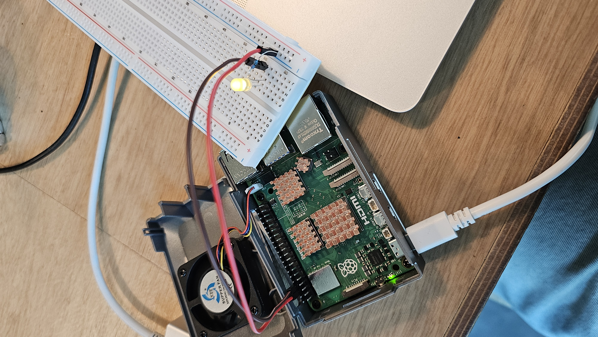
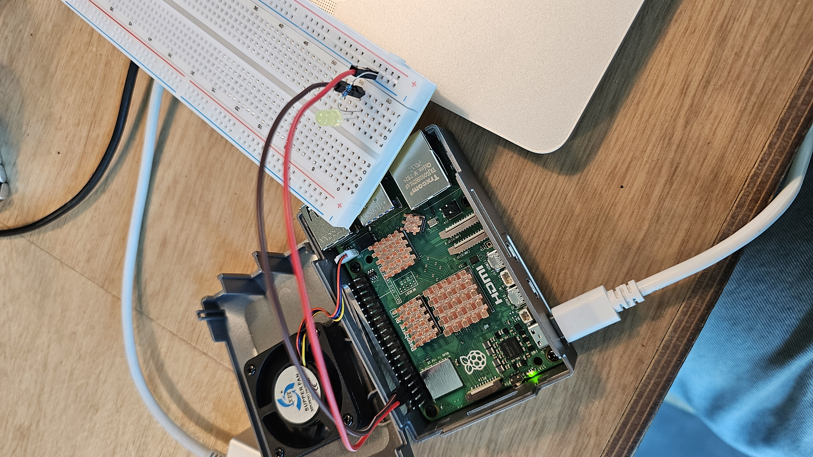

# IoT26-HW01 Team C (Cho Wooyoung, Seol Jaemin, Lim Youbin)

Since this assignment covers the fundamentals, we each decided to implement/practice the code individually to ensure a clear understanding of the Raspberry Pi GPIO control. As a result, there are three variations of code, performing the same
core task.

## Result

### Photos

### Demo video (muted by default; unmute in the player if needed)

<video width="640" controls muted playsinline>
  <source src="results/HW1.mp4" type="video/mp4">
  Your browser does not support the video tag — use the MP4 link below.
</video>

[Download HW1.mp4](results/HW1.mp4)

## Screenshot of RPI IDE showing selected board & port